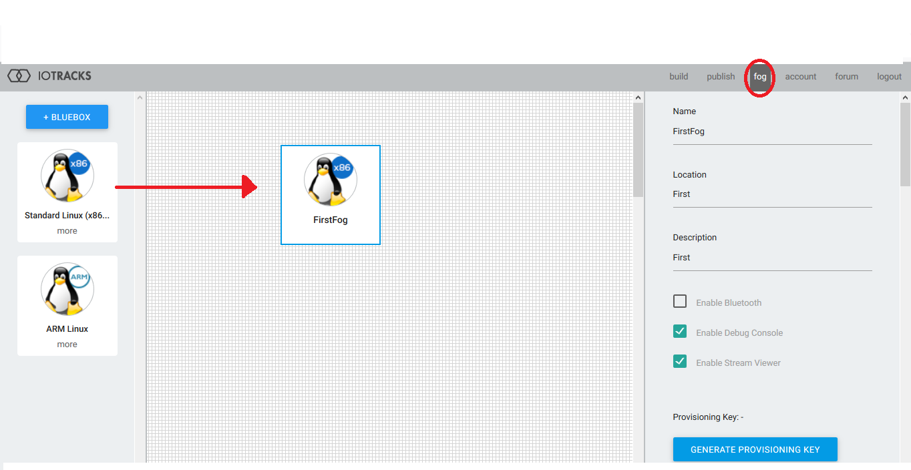

[](http://www.apache.org/licenses/LICENSE-2.0.txt)

# IOFOG EDGE PROCESSING FLOW
This document discuss how IOFOG can be used to filter data at the edge. IOFOG platform provide a way to run code remotely.The code/logic which we want to run is packaged as small micro services which are provided as a docker images.IOFOG provide interface to communicate between 
these micro services. Flow of data is assume to be starting from a microservices which generate time series data. This data is then filtered using Tempus Filter service. Using MQTT service the filtered data is sent to ThingsBoard server. 
## Table of Contents

- [Features](#features)
- [Requirements](#requirements)
- [Getting Started](#getting-started)
- [Usage](#usage)
- [License](#license)

## Features

Tempus IOFOG services has following feature:

* Create Micro-service for creating simulated timeseries data.
* Create a filter service which filter out data at source. 
* Send only filtered data to the ThingsBoard.


## Requirements

* JDK 1.8 at a minimum
* Maven 3.1 or newer
* Git client (to build locally)


## Getting Started

### Install IOFOG


Create an account with IOTRACKS to use IOFOG service

    https://iotracks.com/signup
       
Follow instructions in following link to install iofog on your machine:

    https://iotracks.com/products/iofog/installation/linux/ubuntu

    
### Provision the IOFOG 
   
Login IOFOG to access tracks and fog. 

    https://iotracks.com/login       

After login go to the fog tab drag a fog instance on fog page.And click on new fog instance.

</img> 

Click on new fog instance.On right hand you will see properties of fog. 
Press the generate key to get id of the fog for provisioning. 
     

Go to your Linux command line, type 'sudo iofog provision ABCDWXYZ' and replace the ABCDWXYZ
with your provisioning key (it is case sensitive) and verify the results
You can follow below link to get started:

   https://iotracks.com/build-sample

### Creating propriety microservice 

IOFOG provide SDK in four languages to create microservices:
1) Java
2) Python
3) NodeJS
4) Go


We have already created 3 microservices code of which can be seen in following github link:

``` https://github.com/hashmapinc/tempus-iofog.git ```

Following are docker images of same:
```
1) hashmapinc/iofog:TS
2) hashmapinc/iofog:jsonfilter
3) hashmapinc/iofog:mqtt-client
```

### Publishing propriety microservice 

1.Login the iofog.

2.Use the "Publish" menu to access the publishing portal.

3.Drag and drop the element to the main area.

4.Add Name to your Element.

5.Add Container Image URL. It is the path to repository where the container is posted
  Be sure to enter your container image string properly.

</img> 

Following link discuss in detail how to create and publish microservices:

```https://iotracks.com/creatingmicroservices  ```

### Configuring Services

1) **Time Series Service**:
   
    No Configuration Needed.
2) **Json Filter Service**:

  Basic building block of the service has 3 terms:
  
  
   `{
      	"term": "value.density",
               "OP" : "GTE",
             "value":   0
    }`
  
  
  i) **term**   : The term in json on which filter needs to be applied. The child term can be 
    accessec using dot.
    Example:
    
   ` {
       "range": {
                    "start":0,
                    "end":100
                 }
    }`
    
  if you want to filter on "start" mention "range.start" in the term.
    
  ii) **OP**  : Operation is what operation you need to perform on the the term.Allowed operation
  
      1) LEQ : less than equal
      2) GEQ : greater than equal
      3) LT  : less than
      4) GT  : greater tham
      5) EQ  : equals
      6) NEQ : not equal
  
  iii)**value**  : Value with which operation on term need to be done
  
  Filters are furthur divided into     
  a) String Filters
  
  b) Double Filters
  
  c) Boolean Filters
  
 ` {
     "DOUBLE":{
  	"term": "value.density",
           "OP" : "GTE",
         "value":   0
  	`}
  }
  
  This tells filter type of term.
  
  To create complex query **AND** and **OR** Filters are also provided.
  AND/OR filter 
  
  `{
     "EXP1":"..",
      "EXP2":".."
  } `  
  Both EXP1/EXP2 both can be again AND ,OR filter or and of String,Double or Boolean Filter
  
  
`{

	"OR": {
		"EXP1": {
			"AND": {
				"EXP1": {
					"DOUBLE": {
						"term": "value.density",
						"OP": "GTE ",
						"value": 0
					}
				},
				"EXP2": {
					"DOUBLE": {
						"term": "value.density",
						"OP": "LTE",
						"value": 1
					}
				}
			}
		},
		"EXP2": {
			"STRING": {
				"term": "value.TYPE.id",
				"OP": "NEQ",
				"value": "TEST"
			}
		}
	}
}
`

3)**MQTT-Service**

  For MQTT service you need to define 
  
  i)   Publishers
  
  ii)  Broker
  
  iii) User of device in things board
  
  Example:
  
`	

{

    "subscriptions": [{

        "topic": "v1/devices/me/telemetry",

        "qos": 2

    }],

    "publishers": [{

        "topic": "v1/devices/me/telemetry",

        "qos": 2

    }],

    "broker": {

        "host": "192.168.1.183",

        "port": 1883

    },

    "user": {

        "username": "ioFogToken",

        "password": " "

    }

}`
  
  
       
    

    

## Usage

1) Publish the 3 tempus services as discussed above.
2) Configure the services.
2) Create a track with  services as shown below.

</img>  

4) You can check data flowing into ThingsBoard.


## License

Licensed under the Apache License, Version 2.0 (the "License");
you may not use this file except in compliance with the License.
You may obtain a copy of the License at

  http://www.apache.org/licenses/LICENSE-2.0

Unless required by applicable law or agreed to in writing, software
distributed under the License is distributed on an "AS IS" BASIS,
WITHOUT WARRANTIES OR CONDITIONS OF ANY KIND, either express or implied.
See the License for the specific language governing permissions and
limitations under the License.

 

